# NeoPayPlus EMV Transaction Flow - Complete System Diagram

## 📋 Table of Contents

1. [System Architecture Overview](#system-architecture-overview)
2. [Complete Transaction Flow Diagram](#complete-transaction-flow-diagram)
3. [Key Features & Components](#key-features--components)
4. [Data Flow Details](#data-flow-details)
5. [Error Handling & Offline Queue](#error-handling--offline-queue)
6. [Integration Points](#integration-points)

---

## System Architecture Overview

```
┌─────────────────────────────────────────────────────────────────┐
│                    NeoPayPlus POS System                        │
├─────────────────────────────────────────────────────────────────┤
│                                                                 │
│  ┌──────────────┐    ┌──────────────┐    ┌──────────────┐    │
│  │   Main UI    │───▶│   PayActivity│───▶│ProcessingAct │    │
│  │ (MainActivity)│    │              │    │  (EMV Flow)  │    │
│  └──────────────┘    └──────────────┘    └──────────────┘    │
│         │                    │                    │             │
│         │                    │                    │             │
│  ┌──────────────┐    ┌──────────────┐    ┌──────────────┐    │
│  │ Settlement   │    │   Reversal   │    │ Transaction  │    │
│  │  Activity    │    │    Queue     │    │   Journal    │    │
│  └──────────────┘    └──────────────┘    └──────────────┘    │
│                                                                 │
├─────────────────────────────────────────────────────────────────┤
│                    Sunmi P2 Payment SDK                        │
│  ┌──────────────┐  ┌──────────────┐  ┌──────────────┐         │
│  │  EMVOptV2    │  │ PinPadOptV2  │  │SecurityOptV2 │         │
│  │ (EMV Kernel)│  │  (PIN Entry) │  │  (DUKPT)     │         │
│  └──────────────┘  └──────────────┘  └──────────────┘         │
├─────────────────────────────────────────────────────────────────┤
│                    Backend API Layer                           │
│  ┌──────────────┐  ┌──────────────┐  ┌──────────────┐         │
│  │ Authorization│  │   Reversal   │  │   Config    │         │
│  │    API       │  │     API      │  │    API      │         │
│  └──────────────┘  └──────────────┘  └──────────────┘         │
└─────────────────────────────────────────────────────────────────┘
```

---

## Complete Transaction Flow Diagram

### Mermaid Sequence Diagram

```mermaid
sequenceDiagram
    participant U as User
    participant UI as MainActivity
    participant PA as PayActivity/ProcessingActivity
    participant EMV as EMV Kernel (Sunmi SDK)
    participant PIN as PIN Pad (Sunmi SDK)
    participant SEC as Security Module (DUKPT)
    participant API as Payment API Service
    participant Backend as Backend Server
    participant Queue as Reversal Queue
    participant Journal as Transaction Journal

    Note over U,Journal: === INITIALIZATION PHASE ===

    UI->>PA: User taps "Start Payment"
    PA->>Backend: GET /v1/terminal/config
    Backend-->>PA: {terminal_id, merchant_id, currency}
    PA->>SEC: Inject DUKPT Keys (IPEK + KSN)
    SEC-->>PA: Keys injected ✅

    Note over U,Journal: === EMV TRANSACTION FLOW ===

    PA->>EMV: initEmvProcess()
    EMV-->>PA: Process initialized

    PA->>EMV: transactProcessEx()
    Note over EMV: Card Detection (IC/NFC)
    EMV-->>PA: onFindICCard() / onFindNFCCard()

    EMV->>EMV: Card Selection & AID Matching
    EMV-->>PA: onRequestAppSelect()
    PA->>EMV: importAppSelect(selectedAid)

    EMV->>EMV: Certificate Verification
    EMV-->>PA: onRequestConfirmCardNo()
    PA->>EMV: importCardNoStatus(confirmed)

    Note over U,Journal: === CVM (Cardholder Verification) ===

    EMV->>EMV: CVM List Processing
    EMV-->>PA: onRequestShowPinPad()
    Note over PA: Check CVM Result (9F34)

    alt Offline PIN (9F34 = 42)
        PA->>PIN: Show PIN Pad
        U->>PIN: Enters PIN
        PIN-->>PA: PIN entered (encrypted)
        PA->>EMV: importPinInputStatus(0, 0) ⚡ IMMEDIATE
        Note over PA: No backend call - card verifies PIN
        EMV->>EMV: Offline PIN verification
        EMV-->>PA: Transaction continues
    else Online PIN (9F34 = 01/02)
        PA->>PIN: Show PIN Pad
        U->>PIN: Enters PIN
        PIN->>SEC: Encrypt PIN (DUKPT)
        SEC-->>PIN: PIN Block + KSN
        PIN-->>PA: PIN Block + KSN
        PA->>EMV: importPinInputStatus(0, 0)
        EMV-->>PA: onOnlineProc() ⚡ TRIGGERS BACKEND
    else No CVM (9F34 = 00)
        PA->>EMV: importPinInputStatus(0, 0)
        EMV-->>PA: onOnlineProc()
    end

    Note over U,Journal: === BACKEND AUTHORIZATION ===

    PA->>PA: Extract Field 55 (EMV TLV Data)
    PA->>PA: Build ISO8583 iso_fields
    Note over PA: DE2: PAN, DE3: Processing Code<br/>DE4: Amount, DE11: STAN<br/>DE22: POS Entry Mode<br/>DE49: Currency, DE55: ICC Data

    PA->>API: authorizeTransaction(request)
    Note over API: request = {<br/>  terminal_id, merchant_id,<br/>  amount, currency,<br/>  field55, pinBlock, ksn,<br/>  iso_fields: {<br/>    2: PAN, 3: Processing Code,<br/>    4: Amount, 11: STAN,<br/>    22: POS Entry Mode,<br/>    49: Currency,<br/>    55: Field 55 (ICC Data)<br/>  }<br/>}

    API->>Backend: POST /v1/transactions/authorize
    Note over Backend: Validate PIN (if online)<br/>Process EMV data<br/>Generate response

    alt Authorization Approved (00)
        Backend-->>API: {response_code: "00", rrn, auth_code, field55}
        API-->>PA: AuthorizationResponse (approved)
        PA->>EMV: importOnlineProcStatus(0, tags, values)
        EMV-->>PA: onTransResult(0, "Success")
        PA->>Journal: saveTransaction(record)
        PA->>U: Print Receipt ✅

    else Authorization Declined (05)
        Backend-->>API: {response_code: "05", message}
        API-->>PA: AuthorizationResponse (declined)
        PA->>EMV: importOnlineProcStatus(1, tags, values)
        EMV-->>PA: onTransResult(1, "Declined")
        PA->>U: Show Decline Message ❌

    else Wrong PIN (55/63)
        Backend-->>API: {response_code: "55", message: "INCORRECT_PIN"}
        API-->>PA: AuthorizationResponse (wrongPin)
        PA->>PIN: Retry PIN Entry
        Note over PA: Max 3 attempts
        alt PIN Attempts Exhausted
            PA->>EMV: importOnlineProcStatus(1)
            PA->>U: Transaction Declined ❌
        else PIN Correct on Retry
            PA->>API: Retry authorization
        end

    else Key Sync Required (97)
        Backend-->>API: {response_code: "97", message: "KEY_SYNC"}
        API-->>PA: AuthorizationResponse (keySync)
        PA->>Backend: GET /v1/terminal/dukpt
        Backend-->>PA: {ipek, ksn, key_index}
        PA->>SEC: Inject new DUKPT keys
        SEC-->>PA: Keys rotated ✅
        PA->>U: Retry transaction

    else Host Timeout / Network Error
        API-->>PA: onAuthorizationError(IOException)
        PA->>Queue: Queue reversal offline
        PA->>EMV: importOnlineProcStatus(1)
        PA->>U: Transaction queued ⏳
    end

    Note over U,Journal: === REVERSAL FLOW (if needed) ===

    alt User Initiates Reversal
        U->>UI: Tap "Reverse" button
        UI->>PA: startReversal()
        PA->>Journal: getLastRrn()
        PA->>U: Show RRN input dialog
        U->>PA: Enter/Select RRN
        PA->>API: reverseTransaction(request)
        API->>Backend: POST /v1/transactions/reverse

        alt Reversal Success
            Backend-->>API: {response_code: "00"}
            API-->>PA: ReversalResponse (approved)
            PA->>Journal: saveTransaction(reversal)
            PA->>U: Print Reversal Receipt ✅
        else Host Unavailable
            API-->>PA: onReversalError()
            PA->>Queue: savePendingReversal()
            PA->>U: Reversal queued ⏳
        end
    end

    Note over U,Journal: === OFFLINE QUEUE RETRY ===

    PA->>PA: retryPendingReversals() (on boot/next transaction)
    PA->>Queue: load() (FIFO)
    alt Queue Not Empty
        PA->>API: Retry first pending reversal
        alt Retry Success
            API->>Backend: POST /v1/transactions/reverse
            Backend-->>API: {response_code: "00"}
            API-->>PA: ReversalResponse (approved)
            PA->>Queue: removeFirst()
            PA->>Journal: saveTransaction(reversal)
            PA->>PA: retryPendingReversals() (next item)
        else Host Still Down
            API-->>PA: onReversalError()
            Note over PA: Stop retrying - will retry later
        end
    end

    Note over U,Journal: === SETTLEMENT / BATCH UPLOAD ===

    U->>UI: Tap "Settlement" button
    UI->>PA: SettlementActivity
    PA->>Journal: getAllTransactions()
    PA->>API: uploadBatch(batchRequest)
    API->>Backend: POST /v1/settlement/upload
    Backend-->>API: {accepted, rejected, batch_id}
    API-->>PA: SettlementResponse
    PA->>U: Show Settlement Results
```



---

## Key Features & Components

### 1. **EMV Transaction Processing**

| Component              | Responsibility                                                     |
| ---------------------- | ------------------------------------------------------------------ |
| `ProcessingActivity`   | Main EMV transaction orchestrator                                  |
| `EMVOptV2` (Sunmi SDK) | EMV kernel interface (card detection, AID selection, CVM)          |
| `EMVListenerV2`        | EMV kernel callbacks (onFindICCard, onRequestPinPad, onOnlineProc) |
| Field 55 Extraction    | Collects all EMV TLV data from kernel                              |

### 2. **PIN Handling**

| PIN Type                      | Flow                                                                    | Backend Call            |
| ----------------------------- | ----------------------------------------------------------------------- | ----------------------- |
| **Offline PIN** (9F34 = 42)   | Card verifies PIN → `importPinInputStatus()` immediately → No backend   | ❌ No PIN block sent    |
| **Online PIN** (9F34 = 01/02) | User enters PIN → DUKPT encryption → PIN Block + KSN → Backend decrypts | ✅ PIN block + KSN sent |
| **No CVM** (9F34 = 00)        | No PIN required → Direct authorization                                  | ❌ No PIN block sent    |

### 3. **DUKPT Key Management**

| Phase              | Action                             | Endpoint                          |
| ------------------ | ---------------------------------- | --------------------------------- |
| **Boot**           | Fetch DUKPT keys (IPEK + KSN)      | `GET /v1/terminal/dukpt`          |
| **Injection**      | Inject keys into Security Module   | `SecurityOptV2.saveKeyDukpt()`    |
| **Rotation**       | Key sync required (response 97)    | Auto-retry with new keys          |
| **KSN Extraction** | Get current KSN for PIN encryption | `SecurityOptV2.dukptCurrentKSN()` |

### 4. **ISO8583 Integration**

| Field    | Description                                        | Source                   |
| -------- | -------------------------------------------------- | ------------------------ |
| **DE2**  | PAN (masked)                                       | Card data                |
| **DE3**  | Processing Code (`000000` = Purchase)              | Fixed                    |
| **DE4**  | Amount (minor units)                               | Transaction amount       |
| **DE11** | STAN (6-digit trace number)                        | Generated from timestamp |
| **DE22** | POS Entry Mode (`051` = Chip+PIN, `071` = NFC+PIN) | Auto-detected            |
| **DE49** | Currency Code (`818` = EGP)                        | Terminal config          |
| **DE55** | ICC Data (EMV Field 55)                            | EMV kernel               |
| **MTI**  | Message Type (`0200` = Financial)                  | Fixed                    |

### 5. **Offline Reversal Queue**

| Feature             | Implementation                                    |
| ------------------- | ------------------------------------------------- |
| **Storage**         | SharedPreferences JSON array (FIFO)               |
| **Queue Entry**     | When host is down or timeout occurs               |
| **Auto-Retry**      | On activity start or after successful transaction |
| **FIFO Processing** | First failed → First retried                      |
| **Queue Removal**   | On successful reversal or decline                 |

### 6. **Transaction Journal**

| Purpose                 | Storage                            |
| ----------------------- | ---------------------------------- |
| **Last RRN**            | Auto-fill for reversals            |
| **Transaction History** | Last 100 transactions              |
| **Reversal Tracking**   | Original transaction lookup by RRN |
| **Settlement Data**     | Batch upload source                |

---

## Data Flow Details

### Authorization Request JSON

```json
{
  "terminal_id": "T001",
  "merchant_id": "M001",
  "amount": 10.0,
  "currency": "EGP",
  "transaction_type": "SALE",
  "pan_masked": "557607******9549",
  "emv_data_raw": "9F2608000000000000000000009F2701...",
  "pin_block": "A1B2C3D4E5F6G7H8",
  "ksn": "FFFF9876543210E00001",
  "cvm_result": "01",
  "cvm_description": "Online PIN",
  "datetime": "2025-01-15T14:32:21Z",
  "iso_fields": {
    "2": "557607******9549",
    "3": "000000",
    "4": "1000",
    "11": "123456",
    "22": "051",
    "49": "818",
    "55": "9F2608000000000000000000009F2701...",
    "mti": "0200"
  },
  "emv_data": {
    "9F26": "ARQC value",
    "9F27": "CVM code",
    "5A": "PAN",
    "9F02": "Amount"
  }
}
```

### Reversal Request JSON

```json
{
  "terminal_id": "T001",
  "merchant_id": "M001",
  "rrn": "123456",
  "amount": "1000",
  "currency": "818",
  "reversal_reason": "USER_REQUEST"
}
```

### Reversal Queue Entry (Offline)

```json
{
  "terminal_id": "T001",
  "merchant_id": "M001",
  "rrn": "123456",
  "amount": "1000",
  "currency": "818",
  "reversal_reason": "HOST_UNAVAILABLE",
  "timestamp": 1705324941000
}
```

---

## Error Handling & Offline Queue

### Authorization Errors

| Error Type        | Response Code | Action                              |
| ----------------- | ------------- | ----------------------------------- |
| **Approved**      | `00`          | Complete transaction, print receipt |
| **Declined**      | `05`          | Show decline message, no receipt    |
| **Wrong PIN**     | `55` / `63`   | Retry PIN (max 3 attempts)          |
| **Key Sync**      | `97`          | Fetch new keys, retry transaction   |
| **Network Error** | `IOException` | Queue reversal, show message        |

### Reversal Errors

| Error Type            | Action                                            |
| --------------------- | ------------------------------------------------- |
| **Reversal Approved** | Remove from queue, save to journal, print receipt |
| **Reversal Declined** | Remove from queue (don't retry)                   |
| **Host Unavailable**  | Save to queue, retry on next activity start       |

### Queue Processing Flow

```
1. User initiates reversal → Backend unavailable
2. Reversal saved to queue (SharedPreferences)
3. Next activity start → retryPendingReversals()
4. Load first item from queue (FIFO)
5. Retry reversal API call
6. If success → Remove from queue, continue with next
7. If still down → Stop retrying (will retry later)
```

---

## Integration Points

### Backend API Endpoints

| Endpoint                     | Method | Purpose                       |
| ---------------------------- | ------ | ----------------------------- |
| `/v1/terminal/config`        | GET    | Fetch terminal configuration  |
| `/v1/terminal/dukpt`         | GET    | Fetch DUKPT keys (IPEK + KSN) |
| `/v1/transactions/authorize` | POST   | Authorization request         |
| `/v1/transactions/reverse`   | POST   | Reversal request              |
| `/v1/settlement/upload`      | POST   | Batch settlement upload       |

### Local Storage

| Storage                 | Purpose                       | Location                 |
| ----------------------- | ----------------------------- | ------------------------ |
| **Transaction Journal** | Transaction history, last RRN | SharedPreferences        |
| **Reversal Queue**      | Pending offline reversals     | SharedPreferences (FIFO) |
| **Terminal Config**     | Cached terminal parameters    | SharedPreferences        |
| **DUKPT Keys**          | Injected into Security Module | Sunmi SDK (hardware)     |

---

## Security Features

### 1. **PIN Encryption**

- Online PIN: DUKPT encrypted PIN block
- Offline PIN: Verified by card, never sent to backend
- PIN attempts: Maximum 3 attempts, then decline

### 2. **Data Masking**

- PAN: Masked format `557607******9549`
- PIN Block: Logged as masked (first 4 + last 4 chars)
- Field 55: Masked in logs (first 10 + last 10 hex chars)

### 3. **Key Management**

- DUKPT keys fetched from backend at boot
- Keys injected into hardware security module
- Key rotation on response code 97
- KSN extracted for each PIN encryption

---

## Flow Summary Timeline

### Typical Transaction (Online PIN)

```
0ms      → User taps "Start Payment"
500ms    → Card detected (IC/NFC)
2000ms   → AID selected, certificate verified
3000ms   → PIN pad shown
5000ms   → PIN entered
5100ms   → PIN block encrypted (DUKPT)
5200ms   → onOnlineProc() triggered
5300ms   → Backend authorization starts
5600ms   → Backend responds: {response_code: "00"}
5700ms   → EMV kernel notified: importOnlineProcStatus(0)
5800ms   → Transaction completes → Print receipt
```

### Offline PIN Transaction

```
0ms      → User taps "Start Payment"
500ms    → Card detected
2000ms   → AID selected
3000ms   → PIN pad shown
5000ms   → PIN entered
5100ms   → importPinInputStatus() ⚡ IMMEDIATE
5200ms   → Card verifies PIN offline
5300ms   → Backend authorization (no PIN block)
5600ms   → Backend responds: {response_code: "00"}
5700ms   → Transaction completes → Print receipt
```

---

## Next Steps & Recommendations

### Immediate Priorities

1. ✅ **EMV Transaction Flow** - Complete
2. ✅ **Online/Offline PIN Handling** - Complete
3. ✅ **DUKPT Key Injection** - Complete
4. ✅ **ISO8583 Integration** - Complete
5. ✅ **Offline Reversal Queue** - Complete

### Future Enhancements

- [ ] Full ISO8583 packer (binary MTI + bitmap)
- [ ] ISO8583 wire logging (raw hex dump)
- [ ] Reversal ISO message (0400 MTI)
- [ ] Settlement batch with ISO8583 format
- [ ] Enhanced PIN block decryption (server-side)
- [ ] Transaction search & filtering
- [ ] Receipt printing (merchant + customer copy)

---

**Document Version:** 1.0  
**Last Updated:** 2025-01-15  
**Status:** ✅ Ready for Review
