# TPK Generation on POS - Implementation Status

## ✅ What Was Implemented

### 1. **KeyManagerPOS.java** - Secure TPK Lifecycle Management

**Location**: `app/src/main/java/com/neo/neopayplus/security/KeyManagerPOS.java`

**Features**:
- ✅ State management (active slot, pin_key_id, KCV, version)
- ✅ Active/standby slot rotation (slot 12/13)
- ✅ Key announcement to backend
- ✅ Local state persistence (SharedPreferences)
- ✅ Zeroization on failure
- ⚠️ **SDK Method Placeholders** (need actual method names from Sunmi PayLib 2.0.32)

### 2. **Key Announce API** - Backend Integration

**Location**: `app/src/main/java/com/neo/neopayplus/api/PaymentApiService.java`

**Endpoints**:
- ✅ `POST /v1/keys/announce` - Announce TPK and get pin_key_id
- ✅ Request: `{terminal_id, kb_pos_b64, kcv, pin_key_set_hint, prev_pin_key_id}`
- ✅ Response: `{pin_key_id, pin_key_set, pin_key_ver}`

### 3. **ProcessingActivity Integration** - Before PIN Pad

**Location**: `app/src/main/java/com/neo/neopayplus/processing/ProcessingActivity.java`

**Changes**:
- ✅ `ensureSessionTPK()` called before PIN pad initialization
- ✅ Uses active slot from `KeyManagerPOS.getActivePinSlot()`
- ✅ Transaction declined if TPK setup fails

### 4. **Authorization Request** - PIN Key ID

**Location**: `app/src/main/java/com/neo/neopayplus/api/PaymentApiServiceImpl.java`

**Changes**:
- ✅ `pin_key_id` included in authorization JSON
- ✅ Loaded from `KeyManagerPOS.State`

---

## ⚠️ SDK Method Verification Required

The implementation includes **placeholder SDK method calls** that need to be verified/replaced with actual Sunmi PayLib 2.0.32 API methods.

### Methods That Need Verification

| Method | Purpose | Current Status | SDK Alternative |
|--------|---------|----------------|-----------------|
| `generateKey()` | Generate key in SE | ⚠️ Placeholder | Check: `generateKeyInSE()`, `createKey()`, etc. |
| `getKeyKcv()` | Read KCV from SE | ⚠️ Placeholder | Check: `getKeyCheckValue()`, `readKcv()`, etc. |
| `exportKeyAsTR31()` | Export TR-31 key block | ⚠️ Placeholder | Check: `hsmExportKeyUnderKEKEx()`, `exportKeyUnderTMK()`, etc. |
| `zeroizeKey()` | Clear key in slot | ✅ Using `deleteKeyEx()` | May need `clearKey()`, `removeKey()` |

### How to Verify SDK Methods

1. **Check SecurityOptV2 Interface**:
   ```bash
   # Search for available methods
   grep -r "generateKey\|exportKey\|getKcv\|TR31" <SDK_JAR_PATH>
   ```

2. **Check Sunmi Documentation**:
   - Look for "Key Generation" or "Key Export" methods
   - Look for "TR-31" or "Key Block" methods
   - Check for HSM (Hardware Security Module) export methods

3. **Fallback Pattern**:
   - If SE generation not available, use server-provided key pattern
   - Backend generates key in HSM → returns TR-31 → device imports it

---

## 🔄 Implementation Flow

### Current Implementation (with placeholders)

```mermaid
sequenceDiagram
    participant PA as ProcessingActivity
    participant KM as KeyManagerPOS
    participant SEC as SecurityOptV2 (SDK)
    participant API as PaymentApiService
    participant Backend as Backend Server

    PA->>KM: ensureSessionTPK()
    KM->>SEC: generateKey(standby) ⚠️ PLACEHOLDER
    SEC-->>KM: Key generated (or error)
    KM->>SEC: getKeyKcv(standby) ⚠️ PLACEHOLDER
    SEC-->>KM: KCV bytes
    KM->>SEC: exportKeyAsTR31(standby) ⚠️ PLACEHOLDER
    SEC-->>KM: TR-31 bytes
    KM->>API: announceKey(kb_pos_b64, kcv)
    API->>Backend: POST /v1/keys/announce
    Backend-->>API: {pin_key_id, pin_key_set, pin_key_ver}
    API-->>KM: KeyAnnounceResponse
    KM->>KM: Swap standby → active, persist state
    KM-->>PA: Success ✅
    PA->>PA: Initialize PIN pad with active slot
    PA->>API: Authorization (includes pin_key_id)
```



### Fallback Pattern (if SDK doesn't support SE generation)

```mermaid
sequenceDiagram
    participant PA as ProcessingActivity
    participant KM as KeyManagerPOS
    participant API as PaymentApiService
    participant Backend as Backend Server
    participant HSM as Backend HSM

    PA->>KM: ensureSessionTPK()
    KM->>API: GET /v1/keys/session (if needed)
    API->>Backend: Request server-generated key
    Backend->>HSM: Generate TPK in HSM
    HSM-->>Backend: TR-31 key block (under Terminal TMK)
    Backend-->>API: {kb_pos_b64, kcv}
    API-->>KM: Server key response
    KM->>SEC: Import TR-31 key block
    KM->>API: announceKey(kb_pos_b64, kcv)
    API->>Backend: POST /v1/keys/announce
    Backend->>HSM: Rewrap under Bank TMK
    HSM-->>Backend: TR-31 (under Bank TMK)
    Backend-->>API: {pin_key_id}
    API-->>KM: KeyAnnounceResponse
    KM->>KM: Persist state
    KM-->>PA: Success ✅
```



---

## 📝 Code Sections to Update

### 1. **KeyManagerPOS.ensureSessionTPK()** - Key Generation

**Current** (Line ~110):
```java
// OPTION 1: Generate key in SE (if SDK supports it)
// NOTE: Replace method names with actual SDK methods if they differ
byte[] generatedKey = null;
try {
    // Try to generate key in SE (this may not exist in all SDK builds)
    // Method signature may vary: generateKeyInSE(slot, keyType, algType)
    LogUtil.e(TAG, "⚠️ Key generation in SE may not be supported - using fallback");
    generatedKey = null; // Will trigger fallback
} catch (Exception e) {
    LogUtil.e(TAG, "Key generation in SE not available: " + e.getMessage());
    generatedKey = null;
}
```

**Action Required**: Replace with actual SDK method if available:
```java
// Example (if SDK has it):
int result = sec.generateKeyInSE(
    standby,
    AidlConstantsV2.Security.KEY_TYPE_PIK,
    AidlConstantsV2.Security.KEY_ALG_TYPE_3DES
);
if (result != 0) {
    // Handle error
}
```

### 2. **KeyManagerPOS.exportKeyAsTR31()** - TR-31 Export

**Current** (Line ~180):
```java
// Check if hsmExportKeyUnderKEKEx exists and can export under TMK
// For now, create a stub TR-31 block
LogUtil.e(TAG, "⚠️ TR-31 export - using stub (replace with actual SDK method)");
return null; // Fallback: Return null to indicate not available
```

**Action Required**: Replace with actual SDK method:
```java
// Option 1: If SDK has direct TR-31 export
byte[] tr31 = sec.exportKeyAsTR31(standby, KEY_TYPE_TMK, USAGE_PIN);

// Option 2: If SDK has hsmExportKeyUnderKEKEx (seen in codebase)
Bundle bundle = new Bundle();
bundle.putInt("keyIndex", standby);
bundle.putInt("kekIndex", TMK_INDEX); // Export under TMK
bundle.putInt("keySystem", SEC_MKSK);
byte[] buffer = new byte[2048];
int len = sec.hsmExportKeyUnderKEKEx(bundle, buffer);
if (len > 0) {
    return Arrays.copyOf(buffer, len);
}
```

### 3. **KeyManagerPOS.exportKeyAsTR31()** - KCV Reading

**Current** (Line ~150):
```java
// NOTE: Replace with actual SDK method: getKeyKcv(), getKeyCheckValue(), etc.
// For now, we'll need to get KCV from key or calculate it
String kcvHex = bytesToHex(kcv);
```

**Action Required**: Replace with actual SDK method:
```java
// Option 1: If SDK has direct KCV read
byte[] kcv = new byte[3];
int result = sec.getKeyKcv(standby, kcv);

// Option 2: Calculate from key (if key is available)
// Use first 3 bytes of encrypted zero vector
```

---

## 🔧 Quick Fix Guide

### If SDK Has `hsmExportKeyUnderKEKEx()` (which exists in your codebase)

**Update `KeyManagerPOS.exportKeyAsTR31()`**:

```java
private static byte[] exportKeyAsTR31(SecurityOptV2 sec, int slot) {
    try {
        // Use hsmExportKeyUnderKEKEx (exists in HsmExportKeyUnderKEKActivity)
        Bundle bundle = new Bundle();
        bundle.putInt("keySystem", AidlConstantsV2.Security.SEC_MKSK);
        bundle.putInt("keyIndex", slot);
        bundle.putInt("kekKeySystem", AidlConstantsV2.Security.SEC_MKSK);
        bundle.putInt("kekIndex", TMK_INDEX); // Export under TMK (index 1)
        bundle.putInt("paddingMode", AidlConstantsV2.Security.NOTHING_PADDING);
        
        byte[] buffer = new byte[2048];
        int len = sec.hsmExportKeyUnderKEKEx(bundle, buffer);
        
        if (len < 0) {
            LogUtil.e(TAG, "hsmExportKeyUnderKEKEx failed, code: " + len);
            return null;
        }
        
        byte[] tr31 = java.util.Arrays.copyOf(buffer, len);
        LogUtil.e(TAG, "✓ TR-31 exported - length: " + tr31.length + " bytes");
        return tr31;
        
    } catch (Exception e) {
        LogUtil.e(TAG, "TR-31 export error: " + e.getMessage());
        return null;
    }
}
```

### If SDK Has Key Generation

**Update `KeyManagerPOS.ensureSessionTPK()`**:

```java
// Generate key in SE
int result = sec.generateKeyInSE(
    standby,
    AidlConstantsV2.Security.KEY_TYPE_PIK,
    AidlConstantsV2.Security.KEY_ALG_TYPE_3DES
);
if (result != 0) {
    LogUtil.e(TAG, "generateKeyInSE failed, code: " + result);
    return false;
}
```

---

## ✅ Integration Points

### 1. **Before PIN Pad** (ProcessingActivity)

```java
// Ensure session TPK before showing PIN pad
boolean tpkReady = ensureSessionTPK();
if (!tpkReady) {
    // Decline transaction
    return;
}

// Use active slot for PIN pad
int activePinSlot = KeyManagerPOS.getActivePinSlot();
pinPadConfig.setPinKeyIndex(activePinSlot);
```

### 2. **Authorization Request** (PaymentApiServiceImpl)

```java
// Include pin_key_id in authorization
KeyManagerPOS.State keyState = KeyManagerPOS.load(MyApplication.app);
if (keyState != null && keyState.pinKeyId != null) {
    json.addProperty("pin_key_id", keyState.pinKeyId);
}
```

---

## 📋 Testing Checklist

- [ ] Verify SDK methods exist (`generateKeyInSE`, `getKeyKcv`, `exportKeyAsTR31` or alternatives)
- [ ] Update method calls in `KeyManagerPOS.java` with actual SDK methods
- [ ] Test key generation in SE (if available)
- [ ] Test TR-31 export under TMK
- [ ] Test key announcement to backend
- [ ] Verify `pin_key_id` is included in authorization requests
- [ ] Test PIN pad with active slot from KeyManagerPOS
- [ ] Test key rotation (standby → active)
- [ ] Test zeroization on failure

---

## 🔐 Security Notes

✅ **No Clear Keys**: TR-31 ensures keys never leave SE in clear text  
✅ **Key Zeroization**: Failed keys are cleared from SE  
✅ **State Persistence**: Only metadata (pin_key_id, KCV) stored locally  
✅ **Dual-Live Acceptance**: Previous key remains valid for 24-48h (backend responsibility)  

---

**Status**: ⚠️ **SDK Methods Need Verification**  
**Implementation**: ✅ **Structure Complete**  
**Next Step**: Verify actual Sunmi PayLib 2.0.32 SDK method names and update placeholders

